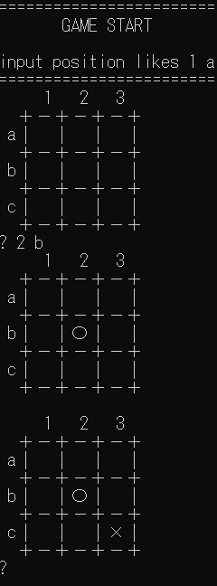

# 課題：強くして
本リポジトリのAIに対して、何らかの工夫をしてください！

* 計算を効率化する
* 新たなアルゴリズムを実装する

5目並べにすると、わかりやすいかもしれません。

# 工夫点

・授業でやった
nega-max
alpha-beta
nega-scout
を実装
・授業のNega-Scout法は深さ制限に達すると引き分けになるため、盤面が大きくなると適当に打つようになってしまう。（5目並べだと顕著）
そのためNega-Scoutを拡張して、得点テーブルとリーチの検知をし、盤面の評価を返す新しいアルゴリズムを追加
・その他、「×」に半角空白を入れて表示がズレる問題を修正するなど、細かく変更

# 取り組み方
* 本プロジェクトをforkして、取り組んでください。
* GitHub Actions (Actionsのタブ )を機能させて、README.mdに記述された下記のバッチの「tpu-game-2026」を自分のアカウントに差し替えてください。
* readme.mdに実施した工夫を記載してください
* 可能であれば、速度等を計測して、具体的な効率化度合い、強さを示してください。
* 納得できるところまでできたところでプルリクを出してください。

（↑のソースコードの「tpu-game-2026」を自分のアカウント名に差し替えてください（2か所））
